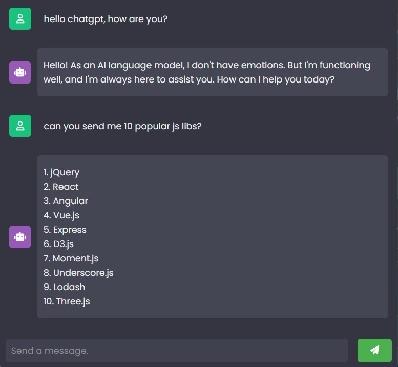

# ChatGPTBot: A ChatGPT Integration with JavaScript

## Overview

**ChatGPTBot** is a JavaScript application that leverages the official ChatGPT API to create an interactive chatbot. Users can ask questions and receive responses powered by ChatGPT. This project also utilizes RapidAPI for managing API requests.



## Technologies Used

- **JavaScript**: For implementing the bot's functionality and interacting with the ChatGPT API.
- **ChatGPT API**: The official API used for generating responses from ChatGPT.
- **RapidAPI**: Used for managing and routing API requests.
- **HTML/CSS**: For building and styling the user interface.

## Features

- **Interactive Chat**: Engage in conversations with ChatGPT by sending messages and receiving responses.
- **API Integration**: Utilizes the official ChatGPT API through RapidAPI for handling requests.
- **Customizable**: Easily integrate with other projects or customize the bot’s functionality.

## Installation

1. Clone this repository:
    ```bash
    git clone https://github.com/vwdr/ChatGPTBot.git
    ```
2. Open `index.js` and replace the placeholder API key on line 46:
    ```javascript
    'X-RapidAPI-Key': 'Your Key',
    ```
3. Open `index.html` in your preferred web browser to start using the ChatGPT bot.

## Usage

1. Load `index.html` in your browser to access the chat interface.
2. Type your questions or messages in the chatbox and press Enter to send.
3. Receive responses from ChatGPT and continue the conversation.

## What I Learned

- **API Integration**: Implemented ChatGPT API using JavaScript for dynamic response generation.
- **RapidAPI Usage**: Configured RapidAPI to manage API requests and handle responses.
- **JavaScript Functionality**: Developed chat functionality, including sending messages and displaying responses.
- **User Interface**: Built and styled a simple user interface for interacting with the chatbot.

## Development

1. **HTML Structure**: Created the HTML layout for the chat interface.
2. **CSS Styling**: Designed the chat interface with CSS for an engaging user experience.
3. **JavaScript Implementation**: Integrated the ChatGPT API and RapidAPI to handle chat interactions.
4. **API Key Management**: Ensured secure management of API keys and configuration.

### Challenges

- **API Key Security**: Managed API keys securely and ensured they are not exposed.
- **Response Handling**: Implemented robust handling of responses and error cases from the API.
- **User Interface Design**: Designed a clean and intuitive chat interface.

## Future Improvements

- **Enhanced Features**: Add more interactive features like user authentication or session management.
- **Custom Responses**: Implement customization options for the chatbot’s responses.
- **Mobile Optimization**: Optimize the interface for mobile devices.

## Contributing

Contributions are welcome! Please fork the repository and submit a pull request with your changes. For bug reports or feature requests, open an issue on GitHub.

## License

This project is licensed under the MIT License - see the [LICENSE](LICENSE) file for details.
